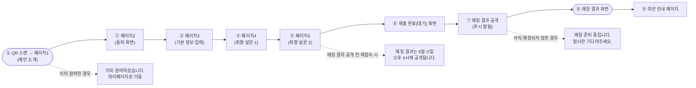
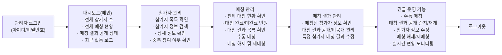

# 72시간 메캠팅 — 유저 플로우

> 기획 단계에서 그려진 다이어그램을 마크다운으로 옮기고, 실제 구현된 앱과 대조한 검토 결과를 아래에 덧붙였다.

## 참가자(사용자) 유저 플로우

- **미션 안내 페이지 내용**: "72시간 미션, 매칭된 상대와 함께 3가지 미션을 완료하세요!"
  1. 캠퍼스의 가을을 함께 사진에 담아주세요!
  2. 축제 부스를 함께 방문해 인증해주세요!
  3. (공식 미션·수제) 학과교류주점에 방문해 함께 사진을 찍고, 상품을 받으세요
  - 완료 조건: 가천대 메디컬캠퍼스 인스타그램으로 DM을 보내 인증

## 관리자(운영자) 유저 플로우

## 유저 플로우 주요 규칙

1. 매칭 결과는 매일 오후 4시에 일괄 공개됩니다.
2. 매칭 전까지는 결과를 볼 수 없으며, 관련 안내 메시지만 표시됩니다.
3. 푸시 알림을 통해 결과 공개를 안내합니다.
4. 미션 인증은 인스타그램 DM으로 운영진이 직접 확인합니다.
5. 온라인 매칭에 문제가 발생할 경우, 관리자 페이지에서 수동 매칭으로 전환합니다.

## 범례

| 기호 | 의미 |
| --- | --- |
| 진한 원(●) | 시작/종료 |
| 흰 사각형 | 화면 |
| 옅은 보라 사각형 | 사용자 행동 |
| 마름모 | 의사결정 |

## 주요 예외 상황

- 이미 참여한 경우 → 마이페이지로 이동
- 매칭 결과 공개 전 접속 시 → 안내 메시지 표시
- 아직 매칭되지 않은 경우 → 준비 중 메시지 표시
- 시스템 오류 발생 시 → 관리자 긴급 운영 기능으로 대응

---

## 검토 — 실제 구현과 다른 부분 (2026-09-05 기준)

이 다이어그램은 기획 초기 문서라 실제 배포된 앱(`https://gachon-mecam-match.vercel.app`)과 몇 군데 어긋나 있다. 참고용으로만 쓰고, 실제 동작 기준은 앱 자체로 삼는 걸 추천한다.

### 참가자 플로우

| 항목 | 다이어그램 | 실제 구현 |
| --- | --- | --- |
| 설문 단계 수 | 페이지3(기본정보) → 페이지4(취향1) → 페이지5(취향2), 총 3단계 | 기본정보 → 취향 → 상대 선호 → **비공개 연락처(인스타·전화번호)**, 총 **4단계**. 다이어그램엔 연락처 입력 단계 자체가 빠져 있음 |
| 미션 안내 | 매칭 결과 화면 다음에 오는 **별도 페이지**(⑨), 미션 문구가 "캠퍼스의 가을을 함께 사진에 담아주세요" 등 3개 | 별도 페이지가 아니라 결과 화면의 **"치트키 열어보기" 버튼을 눌러야 뜨는 바텀시트**(`CheatkeySheet`) 안에 "마지막 미션"이라는 이름으로 들어있음. 문구도 "①서로의 첫인상 말하기 ②공통점 3가지 찾기 ③학과교류주점 방문+사진(상품)"으로 완전히 다름 — 이건 미션 안내 카드 이미지랑은 같고, 롱폼 포스터·이 다이어그램이랑은 또 다름(총 세 군데 문구가 제각각) |
| 미션 완료 저장 | 표시 없음 | 미션 체크는 **브라우저에만 저장**(새로고침하면 초기화). 서버에 저장 안 됨 — 의도된 설계(인스타 DM으로만 인증) |
| 매칭 결과 화면 | 상대방 프로필 사진(원형 아바타) 표시 | 사진 없음 —애초에 설문에서 사진을 받지 않음. 닉네임·학과·학년·성격태그·점수·한마디만 표시 |
| 결과 재확인 경로 | 다이어그램엔 없음 | 실제로는 **`/find` 페이지**(매칭번호+복구코드)로 다른 기기에서도 재조회 가능 — 이건 다이어그램보다 실제 구현이 더 나아간 부분 |

### 관리자 플로우

| 항목 | 다이어그램 | 실제 구현 |
| --- | --- | --- |
| 실제 탭 구성 | 대시보드 → 참가자 관리 → 매칭 관리 → 매칭 결과 관리 → 긴급 운영 기능, 5단계 **직렬 흐름** | 좌측 사이드바에 **개요 / 접수 퍼널 / 매칭 실행 / 운영 대기열 / 행사 제어** 5개 탭이 **동시에** 존재하고 자유롭게 이동(직렬 흐름 아님) |
| 참가자 관리(목록·검색·상세) | 별도 메뉴로 계획됨 | **해당 화면 자체가 없음.** 대신 이번에 추가한 "전체 참가자 내보내기(CSV)"로 전체 명단은 확인 가능하지만, 앱 안에서 이름/번호로 검색하는 화면은 없음 |
| 매칭 해제 및 재매칭 | "매칭 관리"·"긴급 운영 기능" 양쪽에 명시 | 서버 쪽엔 `admin_unmatch` 함수가 이미 있지만, **이걸 누를 수 있는 버튼이 관리자 화면 어디에도 없음**. 지금은 매칭을 잘못 확정했을 때 되돌릴 UI가 없다는 뜻 |
| 최근 활동 로그 | 대시보드에 표시 계획 | 서버에 `audit_events` 테이블로 모든 변경 이력은 쌓이고 있지만, **화면에 보여주는 UI가 없음**(SQL로만 조회 가능) |
| 특정 참가자 정보 수정 | "매칭 결과 관리"·"긴급 운영 기능"에 명시 | 참가자가 제출한 정보를 관리자가 수정하는 기능 자체가 없음 |
| 매칭 결과 공개 on/off | "매칭 결과 관리"에 별도 항목 | 실제로는 "행사 제어" 탭의 "결과 조회 허용" 체크박스 하나로 되어 있음 — 기능은 있음, 위치·이름만 다름 |

### 정리

- 참가자 쪽은 핵심 흐름(신청→대기→매칭 발표→결과)은 다이어그램과 실제가 거의 같고, 세부 문구·단계 수만 갱신이 필요한 수준.
- 관리자 쪽은 **"매칭 해제", "참가자 검색/상세", "최근 활동 로그", "참가자 정보 수정"** 네 가지가 기획엔 있었는데 실제로 안 만들어진 상태. 특히 "매칭 해제"는 문서01의 "장애 발생 시 플레이북"에도 해당하는 기능이라, 행사 당일 매칭을 잘못 확정했을 때 되돌릴 방법이 없다는 게 제일 걸림 — 이거 먼저 만드는 걸 추천.
